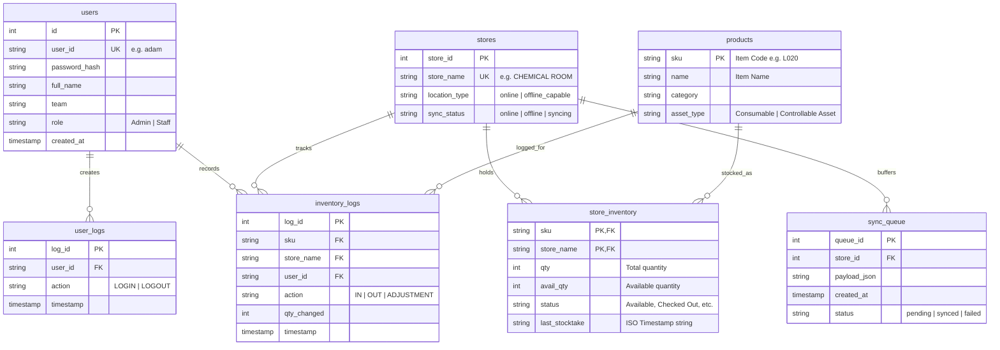
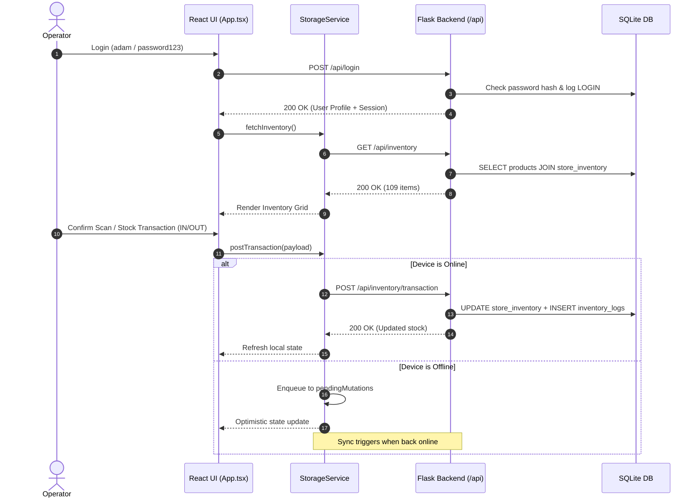

# CORE-INVENTORY — Codebase Analysis & Architecture Guide

## 1. Executive Summary

**CORE-INVENTORY** is an enterprise inventory management and asset tracking system built for the Petronas AI Innovator project. The system provides real-time stock tracking, operator authentication, audit trails, and an offline-first mutation sync queue for facilities operating with intermittent network connectivity.

The project is populated and aligned with real inventory data from `[DATASET_FOR_AI_INNOVATOR] Inventory_Data_with_Photos.xlsx`, tracking 109 catalog items across four primary operational storage locations.

---

## 2. Technology Stack

### Backend
- **Framework**: Python 3 (Flask)
- **Database**: SQLite 3 (`database/inventory_system.db`) with Foreign Key enforcement (`PRAGMA foreign_keys = ON;`)
- **Security**: Werkzeug (`generate_password_hash`, `check_password_hash` with PBKDF2-SHA256)
- **Data Ingestion**: Pandas, OpenPyXL
- **Alternative / Dev Server**: Node.js / Express (`server.ts`) with `node:sqlite` for full-stack Vite middleware integration

### Frontend
- **Framework**: React 19 (TypeScript)
- **Bundler & Dev Server**: Vite 6
- **Styling**: Tailwind CSS 4 + Lucide React icons + Motion animations
- **State & Storage**: Client-side storage service (`localStorage` / offline-first caching) synchronized with Flask REST endpoints

---

## 3. Directory Structure

```
CORE-INVENTORY/
├── database/                                  # Backend & Database layer
│   ├── [DATASET_FOR_AI_INNOVATOR]...xlsx      # Source master Excel dataset
│   ├── app.py                                 # Flask REST API server (Port 5000)
│   ├── import_xlsx_data.py                    # ETL importer script (Excel -> SQLite)
│   ├── init_db.py                             # DB initializer (runs schema.sql)
│   ├── inventory_manager.py                   # Business logic (transactions & sync queue)
│   ├── inventory_system.db                    # Active SQLite database file
│   ├── schema.sql                             # Relational database DDL & indexes
│   ├── test_db.py                             # Test suite script
│   └── README.md                              # Backend documentation
├── src/                                       # Frontend application source
│   ├── components/                            # Reusable UI components & modals
│   │   ├── AuthPage.tsx                       # Operator login UI
│   │   ├── BoundingBoxOverlay.tsx             # Scan visualizer
│   │   ├── CheckoutModal.tsx                  # Item checkout modal
│   │   ├── ConfirmScanModal.tsx               # Stock transaction confirmation modal
│   │   ├── DiagnosticsPanel.tsx               # System telemetry & status
│   │   ├── HeaderBar.tsx                      # Top navigation bar
│   │   ├── Sidebar.tsx                        # Main sidebar navigation
│   │   └── StatCard.tsx                       # KPI metric card
│   ├── data/                                  # Static datasets and location lists
│   │   └── locations.ts                       # Valid location definitions
│   ├── pages/                                 # Top-level view pages
│   │   ├── ActivityHistoryPage.tsx            # Transaction logs & audit trail
│   │   ├── DashboardPage.tsx                  # Overview metrics, alerts, low stock
│   │   ├── InventoryPage.tsx                  # Full catalog view & filtering
│   │   ├── ScanInventoryPage.tsx              # Manual and barcode/scan stock input
│   │   ├── SettingsPage.tsx                   # System settings & offline sync controls
│   │   └── StockCheckPage.tsx                 # Physical stocktake auditing view
│   ├── services/                              # Client services & API abstraction
│   │   ├── authService.ts                     # Auth API client & session caching
│   │   ├── storageService.ts                  # Inventory storage, transaction & sync client
│   │   └── inventoryService.ts                # Inventory calculation helpers
│   ├── types/                                 # TypeScript type definitions
│   │   └── index.ts                           # Data interfaces and location types
│   ├── App.tsx                                # Main application entry & state router
│   ├── main.tsx                               # React root renderer
│   └── index.css                              # Global CSS & Tailwind imports
├── public/                                    # Static assets & icons
├── server.ts                                  # Optional Node.js/Express hybrid runner
├── vite.config.ts                             # Vite configuration
├── package.json                               # Node dependencies & npm scripts
├── tsconfig.json                              # TypeScript compiler settings
└── GEMINI.md                                  # Codebase analysis & project guide
```

---

## 4. Relational Database Architecture (`database/schema.sql`)

Foreign keys are strictly enforced on all connections (`PRAGMA foreign_keys = ON;`).



### Key Schema Design Choices
1. **Natural SKU Primary Key**: `products.sku` directly matches `Item Code` from the master Excel data (e.g., `L001`, `S020`).
2. **Composite Primary Key in Inventory**: `store_inventory(sku, store_name)` allows multi-store tracking of the same SKU with independent stock levels.
3. **Audit Trail Accountability**: `inventory_logs` explicitly references `user_id` and `store_name`, preserving operator accountability for all stock changes.
4. **Dropped Unused CV & Schema Fields**: Unit price, categories table, product_id autoincrement integer, and image detection logs were removed in favor of clean relational tables directly matching the operational requirements.

---

## 5. API Reference (`database/app.py`)

All endpoints communicate using JSON and enforce session authentication where applicable.

| Method | Endpoint | Auth Required | Description |
| :--- | :--- | :--- | :--- |
| `POST` | `/api/login` | None | Authenticates operator (`userId` + `password`), logs `LOGIN` to `user_logs`, creates session cookie. |
| `POST` | `/api/logout` | Session | Logs `LOGOUT` to `user_logs`, clears session cookie. |
| `GET` | `/api/me` | Session | Returns current authenticated operator profile (`userId`, `fullName`, `team`, `role`). |
| `GET` | `/api/inventory` | None | Returns joined product catalog and store inventory. Supports optional `?store_name=` filter. |
| `POST` | `/api/inventory/transaction` | Session | Performs atomic `IN`, `OUT`, or `ADJUSTMENT` stock update and records log entry in `inventory_logs`. |
| `POST` | `/api/sync-queue/process` | Admin Session | Replays buffered offline transactions from `sync_queue` table. |

### Sample Transaction Request Payload:
```json
{
  "sku": "L020",
  "store_name": "CHEMICAL ROOM",
  "action": "OUT",
  "qty_changed": -2
}
```

---

## 6. Frontend Architecture & Flow

### Key Services
- **`authService.ts`**:
  - Handles remote login against `/api/login` and logout against `/api/logout`.
  - Maintains `localStorage` cache for authenticated session persistence across reloads and offline usage.
- **`storageService.ts`**:
  - `fetchInventory()`: Fetches live items from `/api/inventory` with local cache fallback.
  - `postTransaction(txn)`: Performs **optimistic UI updates** locally, then sends the update to `/api/inventory/transaction`.
  - `syncQueue()`: If offline, transactions are pushed into the `pendingMutations` queue. When connectivity is restored, `syncQueue()` flushes queued mutations to the server.

### Application Workflow


---

## 7. Master Dataset & Seed Data

The database is initialized from `[DATASET_FOR_AI_INNOVATOR] Inventory_Data_with_Photos.xlsx` via `database/import_xlsx_data.py`.

### Summary of Imported Data
- **Stores (4 locations)**:
  1. `CHEMICAL ROOM`
  2. `CHILLAX`
  3. `MAKER STUDIO`
  4. `STORE 1`
- **Products**: 109 unique SKUs across categories (Laboratory & Science Supplies, Consumables, Hardware Tools, IT Equipment, etc.).
- **Initial Administrator Account**:
  - **User ID**: `adam`
  - **Password**: `password123`
  - **Full Name**: `System Admin`
  - **Team**: `IT`
  - **Role**: `Admin`

---

## 8. How to Run the Project

### Running the Python Flask Backend
```bash
cd database
python import_xlsx_data.py   # Only needed to seed/reset database
python app.py                 # Starts server on http://localhost:5000
```

### Running the React Frontend (Vite)
```bash
# In the root directory
npm install
npm run dev                   # Starts dev server on http://localhost:5173 (or 3000 via server.ts)
```

### Building for Production
```bash
npm run build
npm start
```

---

## 9. Maintainer Notes & Known Considerations

1. **Offline Queue Resilience**: The frontend `pendingMutations` buffer in `localStorage` and backend `sync_queue` table ensure complete zero-data-loss for field audits performed in low/no connectivity areas.
2. **Session Security**: The Flask backend uses HttpOnly cookies (`session_id`). Ensure CORS and credentials (`credentials: 'include'`) are properly configured when proxying Vite requests to Flask.
3. **Database Maintenance**: To re-initialize the database from scratch at any time, execute `python database/init_db.py --reset` followed by `python database/import_xlsx_data.py`.
